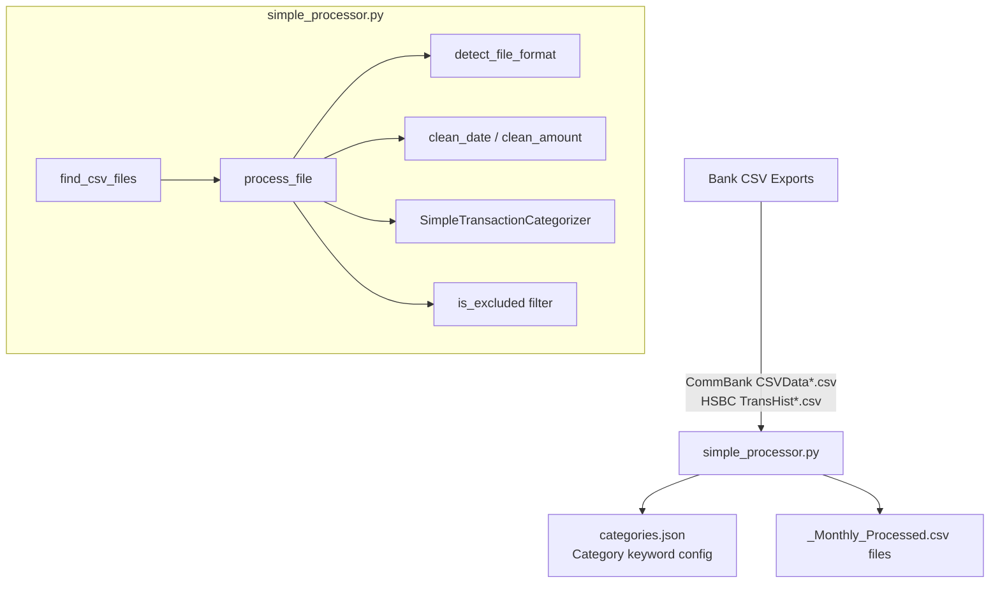
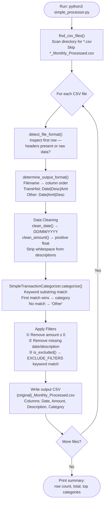
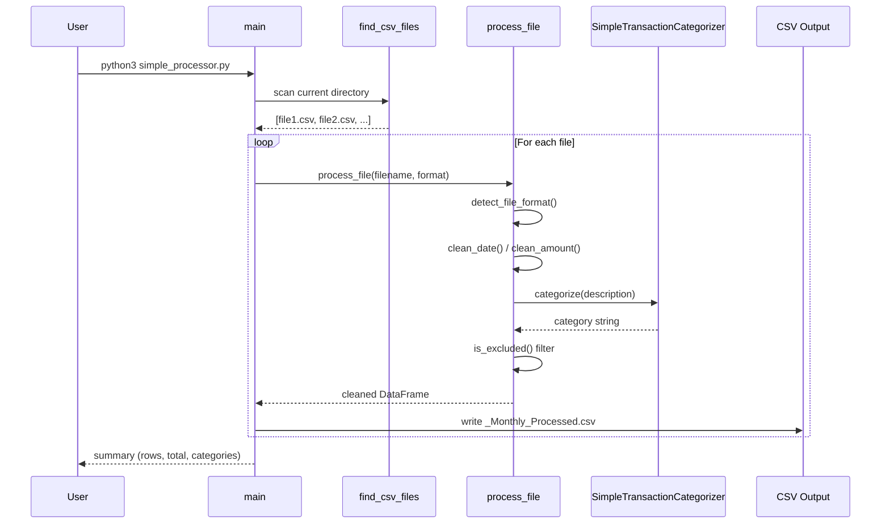
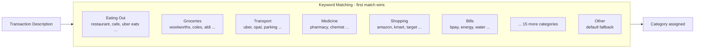
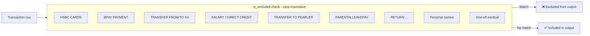

# Architecture Diagrams

## 1. High-Level Component Overview

```mermaid
graph TD
    A[Bank CSV Exports] -->|CommBank CSVData*.csv\nHSBC TransHist*.csv| B[simple_processor.py]
    B --> C[categories.json\nCategory keyword config]
    B --> D[_Monthly_Processed.csv files]

    subgraph simple_processor.py
        E[find_csv_files] --> F[process_file]
        F --> G[detect_file_format]
        F --> H[clean_date / clean_amount]
        F --> I[SimpleTransactionCategorizer]
        F --> J[is_excluded filter]
    end
```

---

## 2. Processing Pipeline

```mermaid
flowchart TD
    Start([Run: python3 simple_processor.py]) --> Discover

    Discover["find_csv_files()\nScan directory for *.csv\nSkip *_Monthly_Processed.csv"] --> Loop

    Loop{For each CSV file} --> Format

    Format["detect_file_format()\nInspect first row —\nheaders present or raw data?"] --> ColMap

    ColMap["determine_output_format()\nFilename → column order\nTransHist: Date|Desc|Amt\nOther: Date|Amt|Desc"] --> Clean

    Clean["Data Cleaning\nclean_date() → DD/MM/YYYY\nclean_amount() → positive float\nStrip whitespace from descriptions"] --> Categorise

    Categorise["SimpleTransactionCategorizer.categorize()\nKeyword substring match\nFirst match wins → category\nNo match → 'Other'"] --> Filter

    Filter["Apply Filters\n① Remove amount ≤ 0\n② Remove missing date/description\n③ is_excluded() → EXCLUDE_FILTERS keyword match"] --> Save

    Save["Write output CSV\n{original}_Monthly_Processed.csv\nColumns: Date, Amount, Description, Category"] --> More

    More{More files?} -->|Yes| Loop
    More -->|No| Summary

    Summary([Print summary:\nrow count, total, top categories])
```

---

## 3. Data Flow

```mermaid
sequenceDiagram
    participant User
    participant main
    participant find_csv_files
    participant process_file
    participant Categorizer as SimpleTransactionCategorizer
    participant Output as CSV Output

    User->>main: python3 simple_processor.py
    main->>find_csv_files: scan current directory
    find_csv_files-->>main: [file1.csv, file2.csv, ...]

    loop For each file
        main->>process_file: process_file(filename, format)
        process_file->>process_file: detect_file_format()
        process_file->>process_file: clean_date() / clean_amount()
        process_file->>Categorizer: categorize(description)
        Categorizer-->>process_file: category string
        process_file->>process_file: is_excluded() filter
        process_file-->>main: cleaned DataFrame
        main->>Output: write _Monthly_Processed.csv
    end

    main-->>User: summary (rows, total, categories)
```

---

## 4. Categorisation Logic

```mermaid
flowchart LR
    Desc[Transaction Description] --> KW

    subgraph KW[Keyword Matching - first match wins]
        direction TB
        C1[Eating Out\nrestaurant, cafe, uber eats ...]
        C2[Groceries\nwoolworths, coles, aldi ...]
        C3[Transport\nuber, opal, parking ...]
        C4[Medicine\npharmacy, chemist ...]
        C5[Shopping\namazon, kmart, target ...]
        C6[Bills\nbpay, energy, water ...]
        C7[... 15 more categories]
        C8[Other\ndefault fallback]
    end

    KW --> Out[Category assigned]
```

---

## 5. Exclusion Filter Flow

```mermaid
flowchart LR
    TX[Transaction row] --> Check

    subgraph Check[is_excluded check - case-insensitive]
        K1[HSBC CARDS]
        K2[BPAY PAYMENT]
        K3[TRANSFER FROM/TO XX]
        K4[SALARY / DIRECT CREDIT]
        K5[TRANSFER TO PEARLER]
        K6[PARENTALLEAVEPAY]
        K7[RETURN ...]
        K8[Personal names]
        K9[One-off medical]
    end

    Check -->|Match| Drop[❌ Excluded from output]
    Check -->|No match| Keep[✅ Included in output]
```
